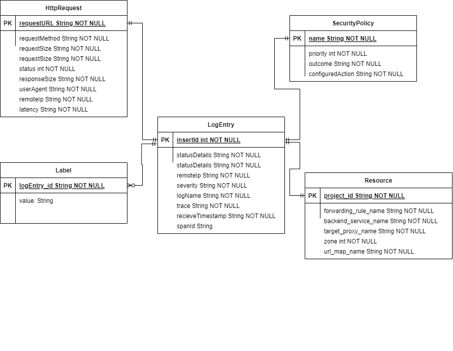

# Prueba Corta 7 y 8

Edgar André Araya Vargas
2020142856

##### 1. Realice un modelo entidad relación normalizado de la  información de logs almacenada por un balanceador de carga en la plataforma GCP.

##### 2.Asumiendo que el sistema manejara millones de registros como el de la pregunta anterior y que la información mas importante es la más reciente ¿Qué motor de bases de datos NoSQL recomendaría utilizar? Explique en detalle.

En un entorno donde se manejan grandes volúmenes de registros y la información más relevante es la más reciente, se recomienda utilizar una base de datos NoSQL orientada a documentos como MongoDB. Este motor de base de datos ofrece un enfoque flexible y escalable para el almacenamiento y consulta de datos.

MongoDB se basa en un modelo de documentos JSON, lo que permite estructurar y almacenar la información completa de cada registro de log de manera jerárquica. Esto resulta especialmente útil para el ejemplo proporcionado, donde se tienen campos anidados y complejos en cada registro. Además, MongoDB está diseñado para escalar horizontalmente, lo que significa que puede manejar eficientemente grandes volúmenes de datos distribuyendo la carga en múltiples servidores.

La alta disponibilidad es otro beneficio de MongoDB, ya que permite configurar réplicas y distribuir los datos geográficamente para garantizar la continuidad del servicio y la protección de los datos ante fallos. Además, su poderoso lenguaje de consultas y la capacidad de indexación de datos aseguran una rápida recuperación de la información requerida.